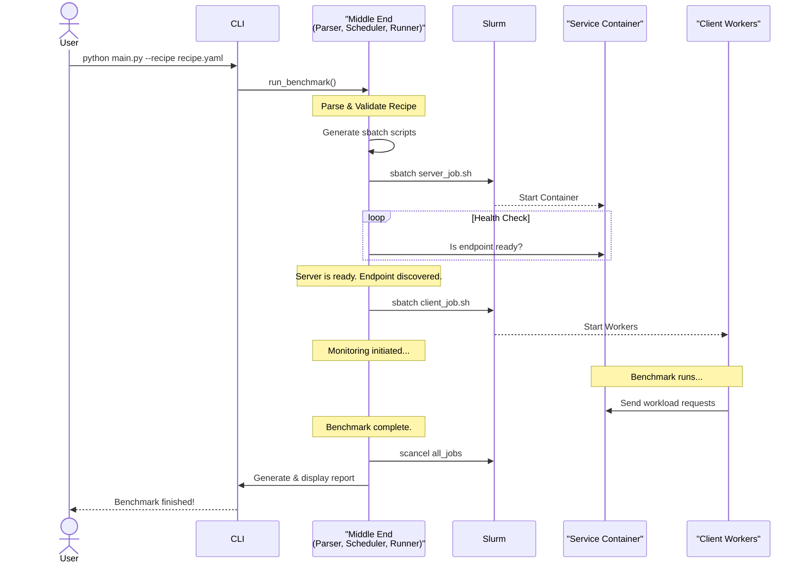

# First architecture design

## 1. Project Overview

The core mission is to develop a tool that automates the entire lifecycle of a performance benchmark. A user will define the service to deploy, the client workload to generate and parameters to monitor in a single YAML configuration file (defined as "recipe"). Our framework will first parse this recipe and handle the benchmarking in a complete transparent way and in the end return a comprehensive report in the form of logs and collected data.

## 2. High-Level Architecture

A key principle we wanted to adopt is the **Separation of Concerns**, dividing the system into three distinct layers for a modular, maintainable, and extensible framework. This is needed because we aim to integrate in the future additional features such as a Web Interface and more services to test.

*   **Frontend:** The user interaction layer. Responsible for receiving user input and displaying status updates.
*   **Middle End:** The orchestration that can be seen as the "brains" of the application, which will manage the generation and execution of services and client workload. It will also manage the monitor process.
*   **Backend:** The execution layer. Represents the actual jobs and processes running on the MeluXina cluster.

## 3. Workflow & Component Interaction

This is how we plan to execute a benchmark. We aim to verify that services are OK before clients are deployed and that all resources are cleaned up reliably.

### Component Breakdown:

#### **Frontend**
*   **Input:** Receives command-line arguments: `--recipe <path>` and `--output-dir <path>`.
*   **Logic:** A simple CLI that parses arguments, instantiates the Middle End's Orchestrator, and displays status updates and the final results to the user.

#### **Middle End**
This layer is composed of three key components:
1.  **Parser:**
    *   **Responsibility:** Loads the `recipe.yaml` file and validates its structure and data types.
    *   **Output:** A validated Python object representing the user's desired benchmark configuration.
2.  **Scheduler / Script Generator:**
    *   **Responsibility:** Takes the validated recipe object and generates the corresponding `sbatch` scripts for each component (server, client) using templates.
    *   **Output:** A dictionary of strings, where each key is a service name and the value is its  `sbatch` script.
3.  **Runner:**
    *   **Responsibility:** It takes the generated scripts and manages their lifecycle on the cluster.
    *   **Actions:**
        *   Submits the server script to Slurm using `sbatch` and stores the Job ID.
        *   Discovers the server endpoint (still needs to be defined): After the server job is running, the Runner will:
            *   Determine its assigned node IP and exposed port.
            *   Injects this endpoint information into the client script.
            *   Submits the client script to Slurm.
            *   Initiates the monitoring process once the server is confirmed to be healthy.
            *   Waits for job completion and triggers the final cleanup.

#### **Backend**
*   **Server/Client Jobs:** These are the actual processes running on the Slurm cluster, launched via the `sbatch` scripts. They run inside **Apptainer** containers.
*   **Monitor:** A  process responsible for data collection.
    *   **Tooling:** The initial implementation will use `sstat` to periodically query Slurm for job statistics (CPU, Memory, etc.).
    *   **Output:** The collected time series data will be saved to a CSV file in the user's specified output directory.

## 4. Initial Services to Benchmark

To guide our development, we will initially focus on supporting the following services:
*   **LLM Inference Server:** **vLLM**
*   **Relational Database:** **PostgreSQL**
*   *(Others will be considered after those are implemented )*

## 5. Core Technology Stack

Our choice of technologies is based on industry standards, robustness, and suitability for the HPC environment on MeluXina.

*   **Python 3.9+:** The primary language for the framework.
*   **Pydantic:** Standard for data validation in Python. It will be used by the `Parser` to validate the `recipe.yaml` file.
*   **Jinja2:** Templating engine used by the `Scheduler` to generate `sbatch` scripts. Its use is a best practice, also seen in frameworks like ReFrame(CSCS).
*   **Apptainer:** The standard for containerization in HPC. It is actively maintained and already available on MeluXina.
*   **Slurm:** The resource manager and job scheduler already present on MeluXina.

### Tech Stack to Investigate:
*   **Real-time Monitoring:** While `sstat` provides an ok baseline, we will study the integration **Grafana + Prometheus** for more advanced visualization of metrics.
